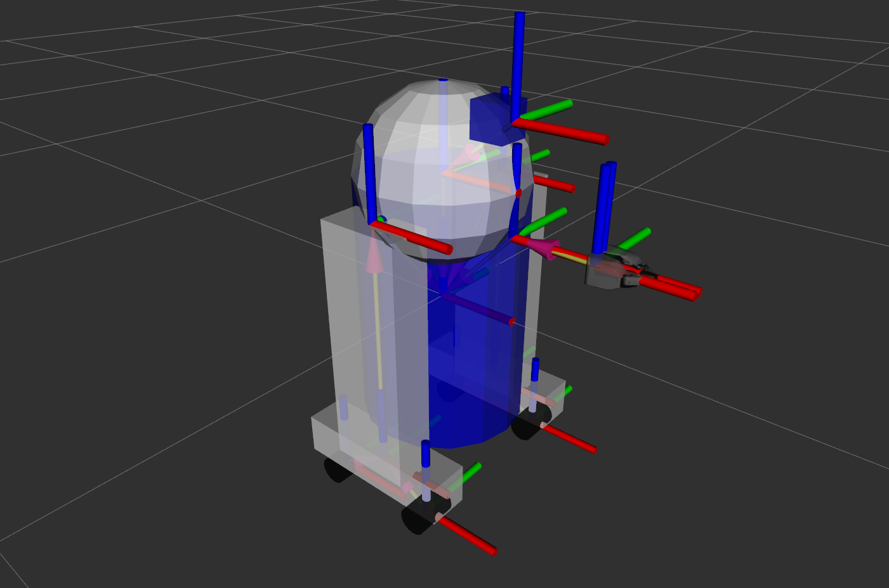
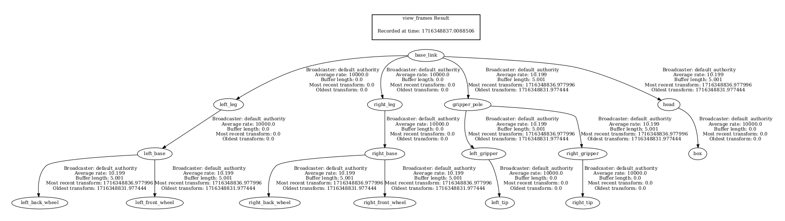

## Section 2. TF (Transform) Overview

Install `urdf_tutorial` package.

```
sudo apt install ros-humble-urdf-tutorial
```

Check the share folder for installed packages.

```
cd /opt/ros/humble/share/ && ls
```

Navigate the folder for the installed URDF tutorial package.

```
cd urdf_tutorial && ls
```

Launch the URDF tutorial and visualize TFs.

```
ros2 launch urdf_tutorial display.launch.py model:=urdf/08-macroed.urdf.xacro
```



Install `tf2_tools` package.

```
sudo apt install ros-humble-tf2-tools
```

Create a pdf file for visualizing the TF tree.

```
ros2 run tf2_tools view_frames
```


