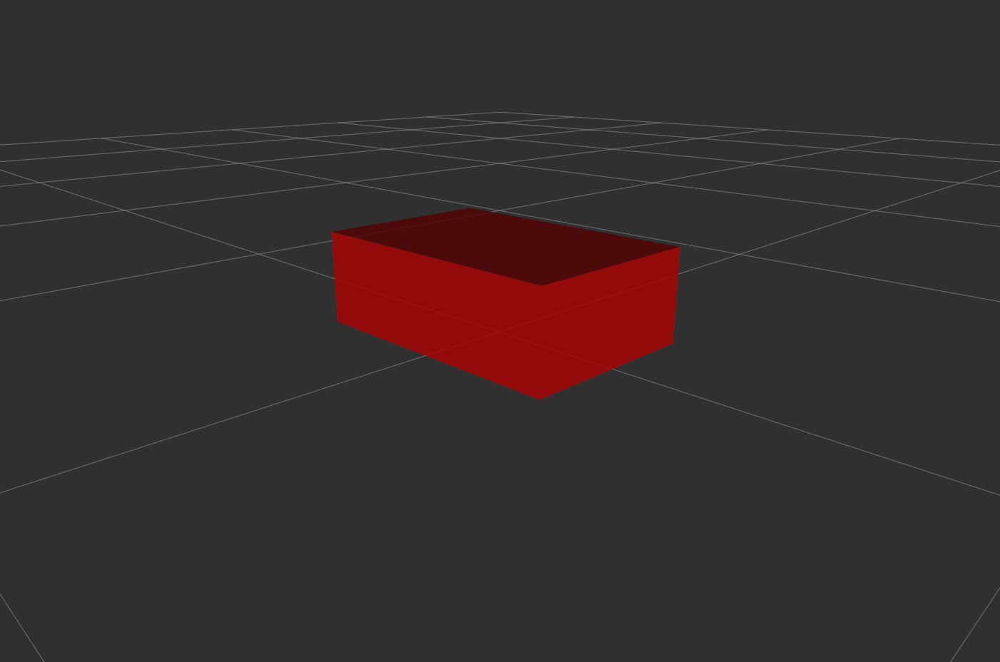
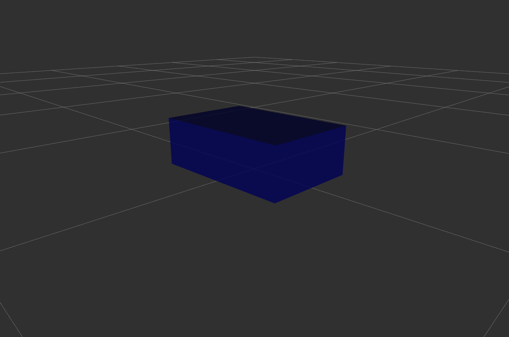
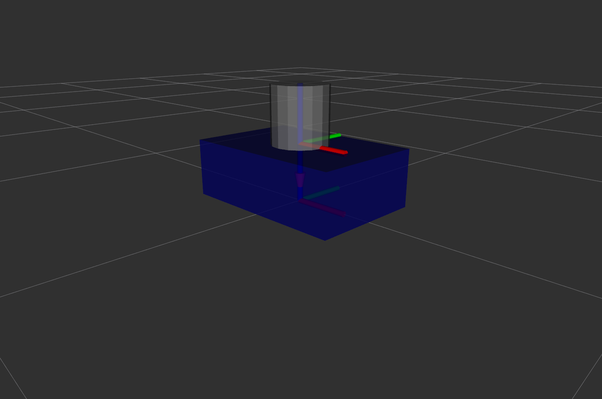
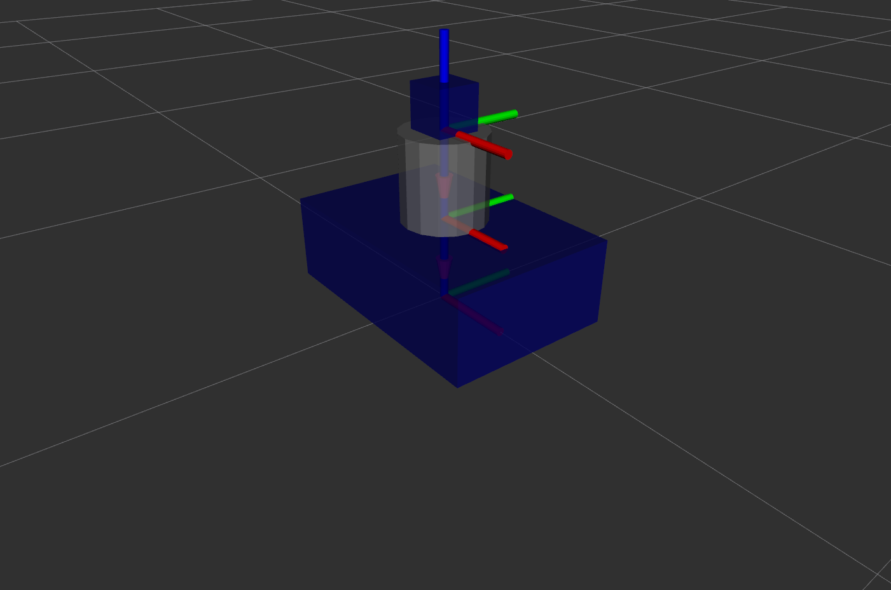
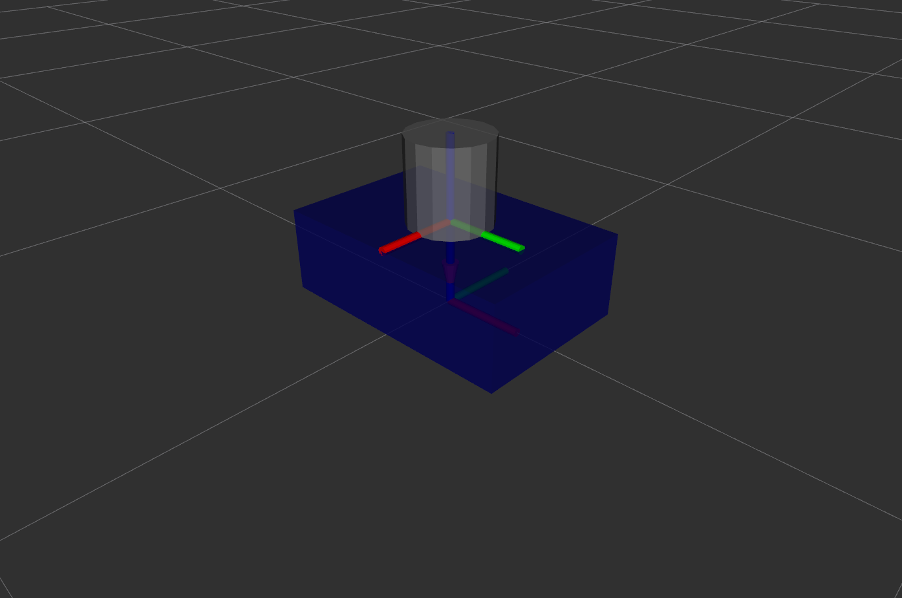
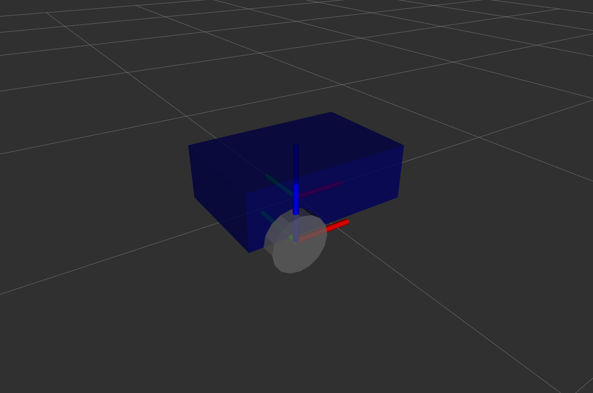
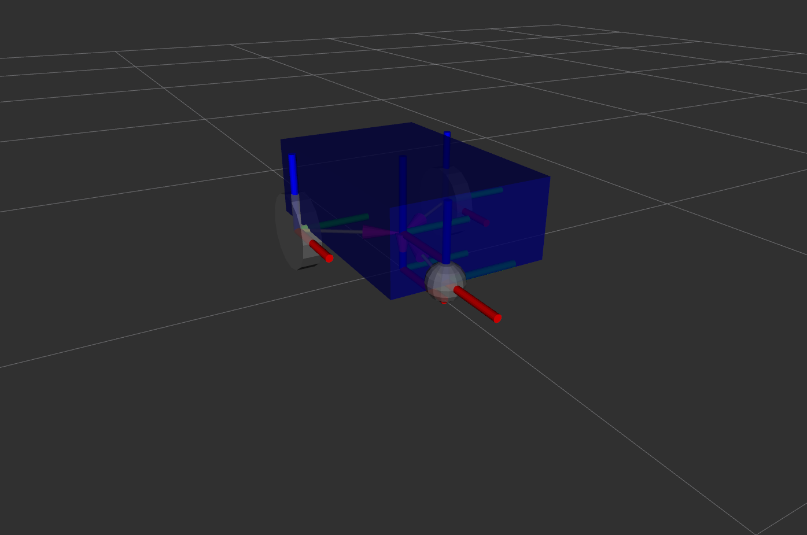
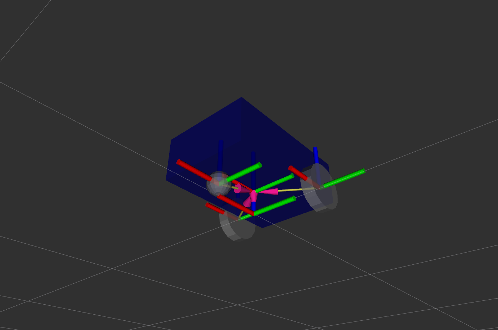

## Section 3. Create a URDF for a Robot

In this section, you will learn to create a unified robot description format (URDF) file, which is an XML specification used to model multibody systems.

### Create and Visualize a Link

First, create an empty URDF file.

```
cd ros2_ws
touch my_robot.urdf
```

Edit the URDF file to include the following lines. Name the first link as `base_link`.

```
<?xml version="1.0"?>
<robot name="my_robot">
    <link name="base_link">
        <visual>
            <geometry>
                <box size="0.6 0.4 0.2" />
            </geometry>
            <origin xyz="0 0 0.1" rpy="0 0 0" />
        </visual>
    </link>
</robot>
```

Launch the URDF tutorial and visualize the link.

```
ros2 launch urdf_tutorial display.launch.py model:=$HOME/ros2_ws/my_robot.urdf
```



### Material - Add Some Colors

Add material tags inside the robot tag and specify colors. Also add a material tag inside a link tag to use a color of your choice for that particular link.

```
<?xml version="1.0"?>
<robot name="my_robot">

    <material name="red">
        <color rgba="0.5 0 0 1" />
    </material>

    <material name="green">
        <color rgba="0 0.5 0 1" />
    </material>

    <material name="blue">
        <color rgba="0 0 0.5 1" />
    </material>

    <link name="base_link">
        <visual>
            <geometry>
                <box size="0.6 0.4 0.2" />
            </geometry>
            <origin xyz="0 0 0.1" rpy="0 0 0" />
            <material name="blue" />
        </visual>
    </link>
</robot>
```

Launch the URDF tutorial and visualize the color change.

```
ros2 launch urdf_tutorial display.launch.py model:=$HOME/ros2_ws/my_robot.urdf
```



### Combine Two Links with a Joint

Add `second_link` to the URDF file and assign a different material to this link. When adding a new link, it is recommended that you set the origin to "0 0 0" first. Also add a joint tag to specify the relationship between `base_link` and `second_link`. When combining two links, make sure to first specify the offset in the origin tag inside the joint tag and then change the origin in the visual tag of the link as necessary.

```
<?xml version="1.0"?>
<robot name="my_robot">

    <material name="red">
        <color rgba="0.5 0 0 1" />
    </material>

    <material name="green">
        <color rgba="0 0.5 0 1" />
    </material>

    <material name="blue">
        <color rgba="0 0 0.5 1" />
    </material>

    <material name="grey">
        <color rgba="0.5 0.5 0.5 1" />
    </material>

    <link name="base_link">
        <visual>
            <geometry>
                <box size="0.6 0.4 0.2" />
            </geometry>
            <origin xyz="0 0 0.1" rpy="0 0 0" />
            <material name="blue" />
        </visual>
    </link>

    <link name="second_link">
        <visual>
            <geometry>
                <cylinder radius="0.1" length="0.2" />
            </geometry>
            <origin xyz="0 0 0.1" rpy="0 0 0" />
            <material name="grey" />
        </visual>
    </link>

    <joint name="base_second_joint" type="fixed">
        <parent link="base_link" />
        <child link="second_link" />
        <origin xyz="0 0 0.2" rpy="0 0 0" />
    </joint>
</robot>
```

Launch the URDF tutorial and visualize the changes made so far.

```
ros2 launch urdf_tutorial display.launch.py model:=$HOME/ros2_ws/my_robot.urdf
```



Add `third_link` to the URDF file and also add a joint tag to specify the relationship between `second_link` and `third_link`. Remove unnecessary material tags for now.

```
<?xml version="1.0"?>
<robot name="my_robot">

    <material name="blue">
        <color rgba="0 0 0.5 1" />
    </material>

    <material name="grey">
        <color rgba="0.5 0.5 0.5 1" />
    </material>

    <link name="base_link">
        <visual>
            <geometry>
                <box size="0.6 0.4 0.2" />
            </geometry>
            <origin xyz="0 0 0.1" rpy="0 0 0" />
            <material name="blue" />
        </visual>
    </link>

    <link name="second_link">
        <visual>
            <geometry>
                <cylinder radius="0.1" length="0.2" />
            </geometry>
            <origin xyz="0 0 0.1" rpy="0 0 0" />
            <material name="grey" />
        </visual>
    </link>

    <link name="third_link">
        <visual>
            <geometry>
                <box size="0.1 0.1 0.1" />
            </geometry>
            <origin xyz="0 0 0.05" rpy="0 0 0" />
            <material name="blue" />
        </visual>
    </link>

    <joint name="base_second_joint" type="fixed">
        <parent link="base_link" />
        <child link="second_link" />
        <origin xyz="0 0 0.2" rpy="0 0 0" />
    </joint>

    <joint name="second_third_joint" type="fixed">
        <parent link="second_link" />
        <child link="third_link" />
        <origin xyz="0 0 0.2" rpy="0 0 0" />
    </joint>
</robot>
```

Launch the URDF tutorial and visualize the new changes made.

```
ros2 launch urdf_tutorial display.launch.py model:=$HOME/ros2_ws/my_robot.urdf
```



### Different Types of Joints in a URDF

In addition to the fixed type of joints as shown above, there are different types of joints in a URDF, including revolute, continuous, prismatic, floating, and planar. See the [ROS Wiki](https://wiki.ros.org/urdf/XML) for more detailed information on writing URDF files.

Remove `third_link` as well as the joint tag for the relationship between `second_link` and `third_link`. Change the joint type from "fixed" to "revolute" to enable `second_link` to rotate around the z-axis. Also add axis and limit tags and allow rotation from -90 to +90 degrees. Note that if a continuous type is selected for the joint the limit tag for rotation should be removed as it has no upper and lower limits.

```
<?xml version="1.0"?>
<robot name="my_robot">

    <material name="blue">
        <color rgba="0 0 0.5 1" />
    </material>

    <material name="grey">
        <color rgba="0.5 0.5 0.5 1" />
    </material>

    <link name="base_link">
        <visual>
            <geometry>
                <box size="0.6 0.4 0.2" />
            </geometry>
            <origin xyz="0 0 0.1" rpy="0 0 0" />
            <material name="blue" />
        </visual>
    </link>

    <link name="second_link">
        <visual>
            <geometry>
                <cylinder radius="0.1" length="0.2" />
            </geometry>
            <origin xyz="0 0 0.1" rpy="0 0 0" />
            <material name="grey" />
        </visual>
    </link>

    <joint name="base_second_joint" type="revolute">
        <parent link="base_link" />
        <child link="second_link" />
        <origin xyz="0 0 0.2" rpy="0 0 0" />
        <axis xyz="0 0 1" />
        <limit lower="-1.57" upper="1.57" velocity="100" effort="100" />
    </joint>
</robot>
```

Launch the URDF tutorial and visualize the new changes made.

```
ros2 launch urdf_tutorial display.launch.py model:=$HOME/ros2_ws/my_robot.urdf
```



### Add a Wheel to the Robot

Now remove `second_link` and add a wheel to the `base_link` by writing a new link named `right_wheel_link`. Remove the previously written joint tag. Add a new joint tag and choose a "continuous" type. Use appropriate values for the origin and axis tags such that the wheels can rotate around the y-axis.

```
<?xml version="1.0"?>
<robot name="my_robot">

    <material name="blue">
        <color rgba="0 0 0.5 1" />
    </material>

    <material name="grey">
        <color rgba="0.5 0.5 0.5 1" />
    </material>

    <link name="base_link">
        <visual>
            <geometry>
                <box size="0.6 0.4 0.2" />
            </geometry>
            <origin xyz="0 0 0.1" rpy="0 0 0" />
            <material name="blue" />
        </visual>
    </link>

    <link name="right_wheel_link">
        <visual>
            <geometry>
                <cylinder radius="0.1" length="0.05" />
            </geometry>
            <origin xyz="0 0 0" rpy="1.57 0 0" />
            <material name="grey" />
        </visual>
    </link>

    <joint name="base_right_wheel_joint" type="continuous">
        <parent link="base_link" />
        <child link="right_wheel_link" />
        <origin xyz="-0.15 -0.225 0" rpy="0 0 0" />
        <axis xyz="0 1 0" />
    </joint>
</robot>
```

Launch the URDF tutorial and visualize the new changes made.

```
ros2 launch urdf_tutorial display.launch.py model:=$HOME/ros2_ws/my_robot.urdf
```



### Complete the URDF for the Robot

Finally, write two new links named `left_wheel_link` and `caster_wheel_link` to add to `base_link` another wheel on the other side as well as a caster wheel with a radius of 0.05 and an offset of 0.2 along the x-axis. Also add an empty link and name it `base_footprint`. Add a joint tag named to describe an appropriate relationship between `base_footprint` (parent) and `base_link` (child).

```
<?xml version="1.0"?>
<robot name="my_robot">

    <material name="blue">
        <color rgba="0 0 0.5 1" />
    </material>

    <material name="grey">
        <color rgba="0.5 0.5 0.5 1" />
    </material>

    <link name="base_footprint" />

    <link name="base_link">
        <visual>
            <geometry>
                <box size="0.6 0.4 0.2" />
            </geometry>
            <origin xyz="0 0 0.1" rpy="0 0 0" />
            <material name="blue" />
        </visual>
    </link>

    <link name="right_wheel_link">
        <visual>
            <geometry>
                <cylinder radius="0.1" length="0.05" />
            </geometry>
            <origin xyz="0 0 0" rpy="1.57 0 0" />
            <material name="grey" />
        </visual>
    </link>

    <link name="left_wheel_link">
        <visual>
            <geometry>
                <cylinder radius="0.1" length="0.05" />
            </geometry>
            <origin xyz="0 0 0" rpy="1.57 0 0" />
            <material name="grey" />
        </visual>
    </link>

    <link name="caster_wheel_link">
        <visual>
            <geometry>
                <sphere radius="0.05" />
            </geometry>
            <origin xyz="0 0 0" rpy="0 0 0" />
            <material name="grey" />
        </visual>
    </link>

    <joint name="base_joint" type="fixed">
        <parent link="base_footprint" />
        <child link="base_link" />
        <origin xyz="0 0 0.1" rpy="0 0 0" />
    </joint>

    <joint name="base_right_wheel_joint" type="continuous">
        <parent link="base_link" />
        <child link="right_wheel_link" />
        <origin xyz="-0.15 -0.225 0" rpy="0 0 0" />
        <axis xyz="0 1 0" />
    </joint>

    <joint name="base_left_wheel_joint" type="continuous">
        <parent link="base_link" />
        <child link="left_wheel_link" />
        <origin xyz="-0.15 0.225 0" rpy="0 0 0" />
        <axis xyz="0 1 0" />
    </joint>

    <joint name="caster_wheel_joint" type="fixed">
        <parent link="base_link" />
        <child link="caster_wheel_link" />
        <origin xyz="0.2 0 -0.05" rpy="0 0 0" />
    </joint>
</robot>
```

Launch the URDF tutorial and visualize the new changes made.

```
ros2 launch urdf_tutorial display.launch.py model:=$HOME/ros2_ws/my_robot.urdf
```



