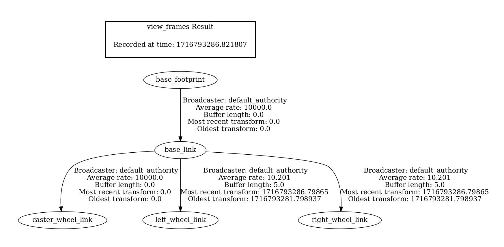
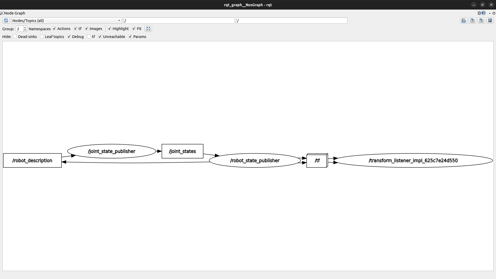
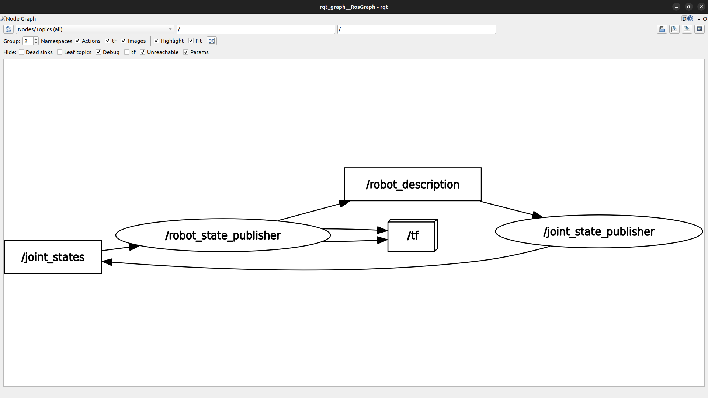
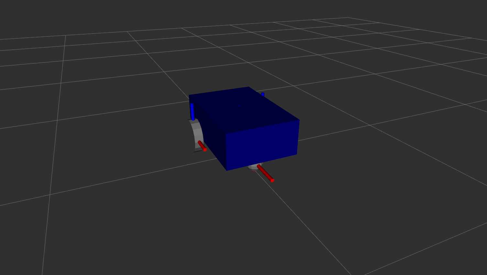
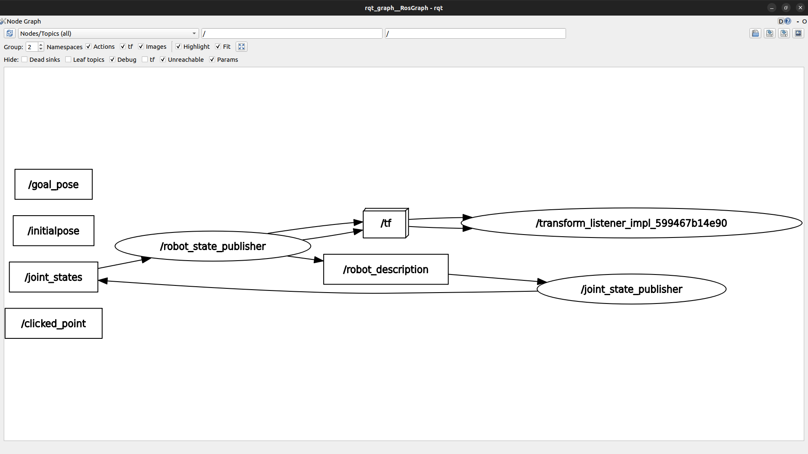

## Section 4. Broadcast TFs with the Robot State Publisher

In this section, instead of the URDF tutorial package that was used previously you will learn to publish TFs from a URDF file.

### How the Robot State Publisher and URDF Work Together

First, launch the URDF tutorial and visualize the links and TFs from the URDF file written in the previous section.

```
ros2 launch urdf_tutorial display.launch.py model:=$HOME/ros2_ws/my_robot.urdf
```

Create a pdf file for visualizing the TF tree.

```
ros2 run tf2_tools view_frames -o my_robot_frames
```



Visualize the nodes and topics with `rqt_graph`.

```
rqt_graph
```



Also check the current list of nodes and topics.
```
ros2 topic list
ros2 node list
```

Output the parameter list for the node `/robot_state_publisher` and find that `robot_description` is present.

```
ros2 param list /robot_state_publisher
```

Output the URDF information.

```
ros2 param get /robot_state_publisher robot_description
```

Output the messages from `/joint_states` topic.

```
ros2 topic echo /joint_states
```

### Run the Robot State Publisher with URDF in the Terminal (Command Line)

Run `robot_state_publisher` with the following command. Xacro, an XML macro language, is a tool used in ROS to create concise and reusable robot descriptions in the URDF. It is essentially a preprocessor that simplifies URDF file writing by providing macros and code generation capabilities.

```
ros2 run robot_state_publisher robot_state_publisher --ros-args -p robot_description:="$(xacro $HOME/ros2_ws/my_robot.urdf)"
```

Run `joint_state_publisher_gui` to create `/robot_state_publisher` node. The Joint State Publisher GUI will appear as a result.

```
ros2 run joint_state_publisher_gui joint_state_publisher_gui
```

Visualize the nodes and topics.

```
rqt_graph
```



Run RViz for visualization of the robot model and TFs. Choose 'base_footprint' for 'Fixed Frame' and add visualization for 'TF' and 'RobotModel' by clicking 'Add' button in the Displays tab. Under 'RobotModel' inside the Displays tab, set 'Description Topic' to `/robot_description`.

```
ros2 run rviz2 rviz2
```



### Create a Robot Description Package to Install the URDF

Now create and build a ROS 2 workspace if you have not done it yet.

```
mkdir -p ros2_ws/src
cd && cd ros2_ws/
colcon build
```

Go to the source folder and create a package for robot description.
```
source install/setup.bash
cd src/
ros2 pkg create my_robot_description
```

Remove unnecessary folders and create a folder for the URDF file. Move the previously created URDF file to this folder.

```
cd my_robot_description/
rm -rf include/ src/
mkdir urdf && cd urdf
mv ~/ros2_ws/my_robot.urdf .
```

Modify `CMakeLists.txt` file for `my_robot_description` package as shown below.

```
cmake_minimum_required(VERSION 3.8)
project(my_robot_description)

if(CMAKE_COMPILER_IS_GNUCXX OR CMAKE_CXX_COMPILER_ID MATCHES "Clang")
  add_compile_options(-Wall -Wextra -Wpedantic)
endif()

# find dependencies
find_package(ament_cmake REQUIRED)

install(
  DIRECTORY urdf
  DESTINATION share/${PROJECT_NAME}
)

ament_package()
```

Build the workspace again and check if the URDF is properly installed. You should be able to find the URDF file inside the folder below.

```
cd ~/ros2_ws/
colcon build
ls install/my_robot_description/share/my_robot_description/urdf/
```

### Write a Launch file to Start the Robot State Publisher with URDF (XML)

Now you will be working on writing a XML launch file. First modify `CMakeLists.txt` file for `my_robot_description` package by adding 'launch' for 'DIRECTORY' as shown below.

```
cmake_minimum_required(VERSION 3.8)
project(my_robot_description)

if(CMAKE_COMPILER_IS_GNUCXX OR CMAKE_CXX_COMPILER_ID MATCHES "Clang")
  add_compile_options(-Wall -Wextra -Wpedantic)
endif()

# find dependencies
find_package(ament_cmake REQUIRED)

install(
  DIRECTORY urdf launch
  DESTINATION share/${PROJECT_NAME}
)

ament_package()
```

Create a folder for launch files and create an empty file named `display.launch.xml`

```
cd ~/ros2_ws/src/my_robot_description/
mkdir launch
cd launch/ && touch display.launch.xml
```

Edit `display.launch.xml` file and write the following:

```
<launch>
    <let name="urdf_path" value="$(find-pkg-share my_robot_description)/urdf/my_robot.urdf" />

    <node pkg="robot_state_publisher" exec="robot_state_publisher">
        <param name="robot_description" value="$(command 'xacro $(var urdf_path)')" />
    </node>

    <node pkg="joint_state_publisher_gui" exec="joint_state_publisher_gui" />

    <node pkg="rviz2" exec="rviz2" output="screen" />
</launch>
```

Build the workspace and start `/robot_state_publisher` node with the launch file.

```
cd ~/ros2_ws/
colcon build
source install/setup.bash
ros2 launch my_robot_description display.launch.xml
```

Visualize the nodes and topics with `rqt_graph`.

```
rqt_graph
```



### Write a Launch file to Start the Robot State Publisher with URDF (Python)

Launch files can also be written in Python. Create an empty file named `display.launch.py` in the launch folder.

```
cd ~/ros2_ws/src/my_robot_description/launch/
touch display.launch.py
```

Edit `display.launch.py` file and write the following:

```
from launch import LaunchDescription
from launch_ros.parameter_descriptions import ParameterValue
from launch_ros.actions import Node
from launch.substitutions import Command
import os
from ament_index_python.packages import get_package_share_path


def generate_launch_description():

    urdf_path = os.path.join(
        get_package_share_path("my_robot_description"), "urdf", "my_robot.urdf"
    )

    robot_description = ParameterValue(Command(["xacro ", urdf_path]), value_type=str)

    robot_description_publisher_node = Node(
        package="robot_state_publisher",
        executable="robot_state_publisher",
        parameters=[{"robot_description": robot_description}],
    )

    joint_state_publisher_gui_node = Node(
        package="joint_state_publisher_gui", executable="joint_state_publisher_gui"
    )

    rviz2_node = Node(package="rviz2", executable="rviz2")

    return LaunchDescription(
        [robot_description_publisher_node, joint_state_publisher_gui_node, rviz2_node]
    )
```

Build the workspace again and start `/robot_state_publisher` node with the launch file written in Python.

```
cd ~/ros2_ws/
colcon build
source install/setup.bash
ros2 launch my_robot_description display.launch.py
```

### Add Rviz Config in the Launch File

The changes previously made to the RViz display configuration can be saved as a file such that it can be loaded when needed. Run RViz for visualization of the robot model and TFs. Before saving the configuration, first create a folder named 'rviz' in the `my_robot_description` package folder.

```
cd ~/ros2_ws/src/my_robot_description/
mkdir rviz
```

Choose 'base_footprint' for 'Fixed Frame' and add visualization for 'TF' and 'RobotModel' by clicking 'Add' button in the Displays tab. Under 'RobotModel' inside the Displays tab, set 'Description Topic' to `/robot_description`. Save the configuration as `urdf_config.rviz` in the rviz folder just created. Close the RViz window and on a separate terminal run RViz with the following command to start RViz with the saved display configuration:

```
cd ~/ros2_ws/
ros2 run rviz2 rviz2 -d ./src/my_robot_description/rviz/urdf_config.rviz
```

It is also possible to make changes to the launch file so that the RViz opens with the desired display configuration when you run the launch file.

Modify `CMakeLists.txt` file for `my_robot_description` package by adding 'rviz' for 'DIRECTORY' as shown below.

```
cmake_minimum_required(VERSION 3.8)
project(my_robot_description)

if(CMAKE_COMPILER_IS_GNUCXX OR CMAKE_CXX_COMPILER_ID MATCHES "Clang")
  add_compile_options(-Wall -Wextra -Wpedantic)
endif()

# find dependencies
find_package(ament_cmake REQUIRED)

install(
  DIRECTORY urdf launch rviz
  DESTINATION share/${PROJECT_NAME}
)

ament_package()
```

Add proper arguments to the rviz2 node tag in `display.launch.xml` as shown below.

```
<launch>
    <let name="urdf_path" value="$(find-pkg-share my_robot_description)/urdf/my_robot.urdf" />

    <let name="rviz_config_path" value="$(find-pkg-share my_robot_description)/rviz/urdf_config.rviz" />

    <node pkg="robot_state_publisher" exec="robot_state_publisher">
        <param name="robot_description" value="$(command 'xacro $(var urdf_path)')" />
    </node>

    <node pkg="joint_state_publisher_gui" exec="joint_state_publisher_gui" />

    <node pkg="rviz2" exec="rviz2" output="screen" args="-d $(var rviz_config_path)" />
</launch>
```

Build the workspace and start `/robot_state_publisher` node with the launch file. Notice RViz opens with the previously saved RViz display configuration applied.

```
cd ~/ros2_ws/
colcon build
source install/setup.bash
ros2 launch my_robot_description display.launch.xml
```

Now add proper arguments to `rviz2_node` in `display.launch.py` as shown below.

```
from launch import LaunchDescription
from launch_ros.parameter_descriptions import ParameterValue
from launch_ros.actions import Node
from launch.substitutions import Command
import os
from ament_index_python.packages import get_package_share_path


def generate_launch_description():

    urdf_path = os.path.join(
        get_package_share_path("my_robot_description"), "urdf", "my_robot.urdf"
    )

    rviz_config_path = os.path.join(
        get_package_share_path("my_robot_description"), "rviz", "urdf_config.rviz"
    )

    robot_description = ParameterValue(Command(["xacro ", urdf_path]), value_type=str)

    robot_description_publisher_node = Node(
        package="robot_state_publisher",
        executable="robot_state_publisher",
        parameters=[{"robot_description": robot_description}],
    )

    joint_state_publisher_gui_node = Node(
        package="joint_state_publisher_gui", executable="joint_state_publisher_gui"
    )

    rviz2_node = Node(
        package="rviz2",
        executable="rviz2",
        arguments=["-d", rviz_config_path]
    )

    return LaunchDescription(
        [robot_description_publisher_node, joint_state_publisher_gui_node, rviz2_node]
    )
```

Build the workspace again and start `/robot_state_publisher` node with the launch file in Python. Again, notice RViz opens with the previously saved RViz display configuration applied.

```
cd ~/ros2_ws/
colcon build
source install/setup.bash
ros2 launch my_robot_description display.launch.py
```
