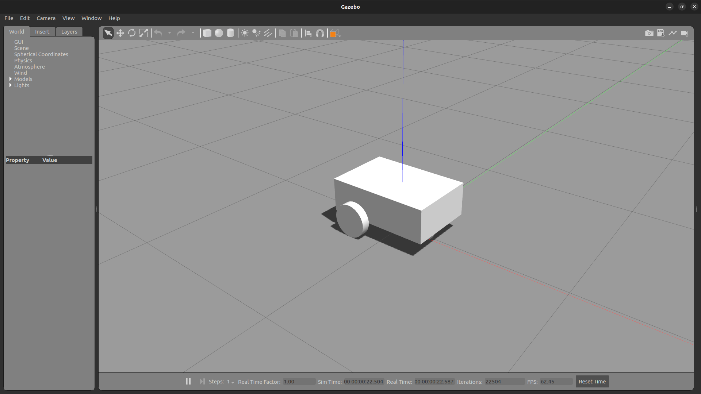

## Section 6. Simulate Your Robot with Gazebo

In this section, you will learn to use Gazebo to simulate the robot you have created. You will be using the Gazebo Classic version in this course. Gazebo is a physics engine that can be used with ROS. We will use the Gazebo ROS package that acts as a bridge between the Gazebo simulation and the ROS environment.

### Run Gazebo

Install Gazebo and ROS 2 Gazebo packages, and run Gazebo.

```
sudo apt install ros-humble-gazebo*
sudo apt install gazebo
gazebo
```

### Add Inertia Tags in the URDF

Edit `common_properties.xacro` file to include [inertia properties](https://en.wikipedia.org/wiki/List_of_moments_of_inertia#List_of_3D_inertia_tensors) to the link elements. Note that inertial tags are required for every link element that will be simulated. See the [ROS Wiki](https://wiki.ros.org/urdf/Tutorials/Adding%20Physical%20and%20Collision%20Properties%20to%20a%20URDF%20Model) for more detailed information on adding physical and collision properties to a URDF model. Add `xacro:macro` tags for inertia properties as shown below.

```
<xacro:macro name="box_inertia" params="m l w h xyz rpy">
    <inertial>
        <origin xyz="${xyz}" rpy="${rpy}" />
        <mass value="${m}" />
        <inertia ixx="${(m / 12) * (h**2 + l**2)}" ixy="0" ixz="0"
                    iyy="${(m / 12) * (w**2 + l**2)}" iyz="0"
                    izz="${(m / 12) * (w**2 + h**2)}" />
    </inertial>
</xacro:macro>

<xacro:macro name="cylinder_inertia" params="m r h xyz rpy">
    <inertial>
        <origin xyz="${xyz}" rpy="${rpy}" />
        <mass value="${m}" />
        <inertia ixx="${(m / 12) * (3 * r**2 + h**2)}" ixy="0" ixz="0"
                    iyy="${(m / 12) * (3 * r**2 + h**2)}" iyz="0"
                    izz="${(m / 2) * (r**2)}" />
    </inertial>
</xacro:macro>

<xacro:macro name="sphere_inertia" params="m r xyz rpy">
    <inertial>
        <origin xyz="${xyz}" rpy="${rpy}" />
        <mass value="${m}" />
        <inertia ixx="${(2 * m / 5) * (r**2)}" ixy="0" ixz="0"
                    iyy="${(2 * m / 5) * (r**2)}" iyz="0"
                    izz="${(2 * m / 5) * (r**2)}" />
    </inertial>
</xacro:macro>
```

Edit `mobile_base.xacro` file to add `xacro:box_inertia` tag to the link element for `base_link`.

```
<xacro:box_inertia m="5.0" l="${base_length}" w="${base_width}" h="${base_height}" xyz="0 0 ${base_height / 2.0}" rpy="0 0 0" />
```

Also add `xacro:cylinder_inertia` tag to the link element for `wheel_link` in `mobile_base.xacro`.

```
<xacro:cylinder_inertia m="1.0" r="${wheel_radius}" h="${wheel_length}" xyz="0 0 0" rpy="${pi / 2.0} 0 0" />
```

Finally, add `xacro:sphere_inertia` tag to the link element for `wheel_link` in `mobile_base.xacro`.

```
<xacro:sphere_inertia m="0.5" r="${wheel_radius / 2.0}" xyz="0 0 0" rpy="0 0 0" />
```

### Add Collision Tags in the URDF

Collision properties can be added to the URDF by adding a collision tag to the link element. Add a collision tag to the link element for `base_link` in `mobile_base.xacro` file. Copy the geometry and origin tags from the visual tag and paste them inside the collision tag. Now the link element for `base_link` should look like this.

```
<link name="base_link">
    <visual>
        <geometry>
            <box size="${base_length} ${base_width} ${base_height}" />
        </geometry>
        <origin xyz="0 0 ${base_height / 2.0}" rpy="0 0 0" />
        <material name="blue" />
    </visual>
    <collision>
        <geometry>
            <box size="${base_length} ${base_width} ${base_height}" />
        </geometry>
        <origin xyz="0 0 ${base_height / 2.0}" rpy="0 0 0" />
    </collision>
    <xacro:box_inertia m="5.0" l="${base_length}" w="${base_width}" h="${base_height}" xyz="0 0 ${base_height / 2.0}" rpy="0 0 0" />
</link>
```

In this example the exact same geometry as visual has been considered for collision, but for robots with more complex shapes simplified geometries like box or cylinder can be used when adding collision properties reduce the computation load. Similar to the change just made to `base_link`, add a collision property tag to `wheel_link` in `mobile_base.xacro` file.

```
<xacro:macro name="wheel_link" params="prefix">
    <link name="${prefix}_wheel_link">
        <visual>
            <geometry>
                <cylinder radius="${wheel_radius}" length="${wheel_length}" />
            </geometry>
            <origin xyz="0 0 0" rpy="${pi / 2.0} 0 0" />
            <material name="grey" />
        </visual>
        <collision>
            <geometry>
                <cylinder radius="${wheel_radius}" length="${wheel_length}" />
            </geometry>
            <origin xyz="0 0 0" rpy="${pi / 2.0} 0 0" />
        </collision>
        <xacro:cylinder_inertia m="1.0" r="${wheel_radius}" h="${wheel_length}" xyz="0 0 0" rpy="${pi / 2.0} 0 0" />
    </link>
</xacro:macro>
```

Also add a collision tag for `caster_wheel_link` in `mobile_base.xacro` file.

```
<link name="caster_wheel_link">
    <visual>
        <geometry>
            <sphere radius="${wheel_radius / 2.0}" />
        </geometry>
        <origin xyz="0 0 0" rpy="0 0 0" />
        <material name="grey" />
    </visual>
    <collision>
        <geometry>
            <sphere radius="${wheel_radius / 2.0}" />
        </geometry>
        <origin xyz="0 0 0" rpy="0 0 0" />
    </collision>
    <xacro:sphere_inertia m="0.5" r="${wheel_radius / 2.0}" xyz="0 0 0" rpy="0 0 0" />
</link>
```
### Spawn the Robot in Gazebo

Run `robot_state_publisher` as shown below. Make sure that the path to the URDF file is correctly given.

```
cd ~/ros2_ws/
source install/setup.bash
ros2 run robot_state_publisher robot_state_publisher --ros-args -p robot_description:="$(xacro $HOME/ros2_ws/src/my_robot_description/urdf/my_robot.urdf.xacro)"
```

Start Gazebo with the ROS integration in a separate terminal.

```
ros2 launch gazebo_ros gazebo.launch.py
```

Spawn the robot in Gazebo in a separate terminal. Note that the robot description topic name (-topic TOPIC_NAME) as well as the robot name (-entity ENTITY_NAME) must be correctly included as options.

```
ros2 run gazebo_ros spawn_entity.py -topic robot_description -entity my_robot
```



The robot spawned in Gazebo slowly moves by itself due to the minor issues with current inertia setting. This will be fixed later.

### Launch File to Start Robot in Gazebo

Create a single launch file to spawn the robot in Gazebo. With this launch file, you will run `robot_state_publisher`, launch Gazebo, spawn the robot, and also start RViz with desired display configuration setting.


First create an empty launch file named `my_robot_gazebo.launch.xml` in the launch folder.

```
cd ~/ros2_ws/src/my_robot_description/launch/
touch my_robot_gazebo.launch.xml
```


