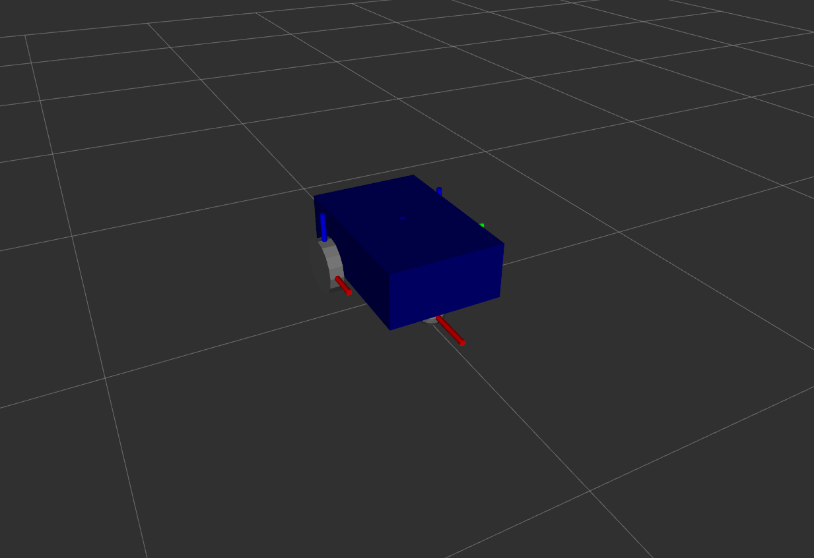
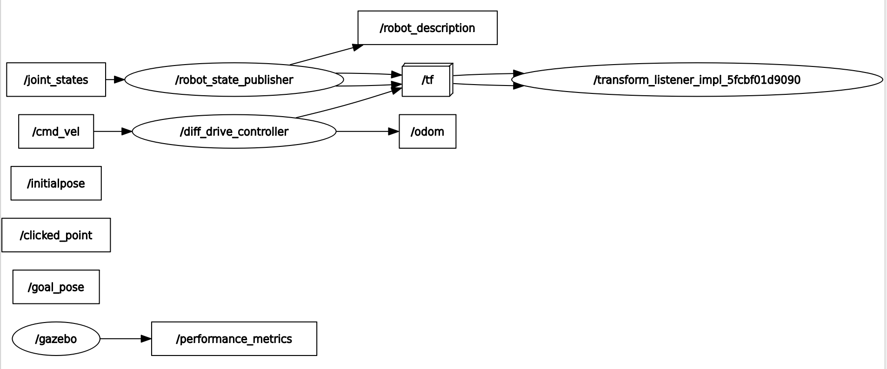
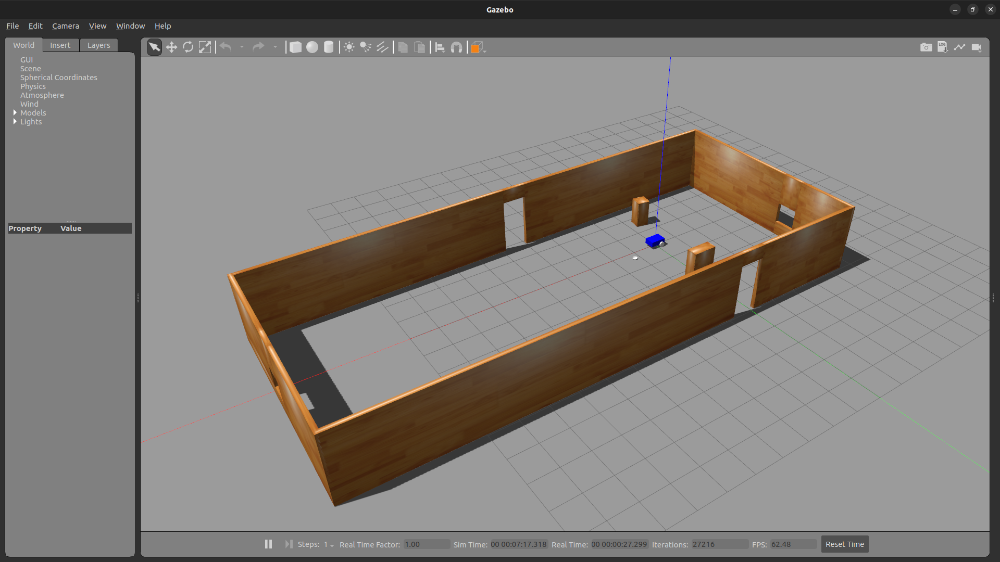

## Section 6. Simulate Your Robot with Gazebo

In this section, you will learn to use Gazebo to simulate the robot you have created. You will be using the Gazebo Classic version in this course. Gazebo is a physics engine that can be used with ROS. We will use the Gazebo ROS package that acts as a bridge between the Gazebo simulation and the ROS environment.

### Run Gazebo

Install Gazebo and ROS 2 Gazebo packages, and run Gazebo.

```
sudo apt install ros-humble-gazebo*
sudo apt install gazebo
gazebo
```

### Add Inertia Tags in the URDF

Edit `common_properties.xacro` file to include [inertia properties](https://en.wikipedia.org/wiki/List_of_moments_of_inertia#List_of_3D_inertia_tensors) to the link elements. Note that inertial tags are required for every link element that will be simulated. See the [ROS Wiki](https://wiki.ros.org/urdf/Tutorials/Adding%20Physical%20and%20Collision%20Properties%20to%20a%20URDF%20Model) for more detailed information on adding physical and collision properties to a URDF model. Add `xacro:macro` tags for inertia properties as shown below.

```
<xacro:macro name="box_inertia" params="m l w h xyz rpy">
    <inertial>
        <origin xyz="${xyz}" rpy="${rpy}" />
        <mass value="${m}" />
        <inertia ixx="${(m / 12) * (h**2 + l**2)}" ixy="0" ixz="0"
                    iyy="${(m / 12) * (w**2 + l**2)}" iyz="0"
                    izz="${(m / 12) * (w**2 + h**2)}" />
    </inertial>
</xacro:macro>

<xacro:macro name="cylinder_inertia" params="m r h xyz rpy">
    <inertial>
        <origin xyz="${xyz}" rpy="${rpy}" />
        <mass value="${m}" />
        <inertia ixx="${(m / 12) * (3 * r**2 + h**2)}" ixy="0" ixz="0"
                    iyy="${(m / 12) * (3 * r**2 + h**2)}" iyz="0"
                    izz="${(m / 2) * (r**2)}" />
    </inertial>
</xacro:macro>

<xacro:macro name="sphere_inertia" params="m r xyz rpy">
    <inertial>
        <origin xyz="${xyz}" rpy="${rpy}" />
        <mass value="${m}" />
        <inertia ixx="${(2 * m / 5) * (r**2)}" ixy="0" ixz="0"
                    iyy="${(2 * m / 5) * (r**2)}" iyz="0"
                    izz="${(2 * m / 5) * (r**2)}" />
    </inertial>
</xacro:macro>
```

Edit `mobile_base.xacro` file to add `xacro:box_inertia` tag to the link element for `base_link`.

```
<xacro:box_inertia m="5.0" l="${base_length}" w="${base_width}" h="${base_height}" xyz="0 0 ${base_height / 2.0}" rpy="0 0 0" />
```

Also add `xacro:cylinder_inertia` tag to the link element for `wheel_link` in `mobile_base.xacro`.

```
<xacro:cylinder_inertia m="1.0" r="${wheel_radius}" h="${wheel_length}" xyz="0 0 0" rpy="${pi / 2.0} 0 0" />
```

Finally, add `xacro:sphere_inertia` tag to the link element for `wheel_link` in `mobile_base.xacro`.

```
<xacro:sphere_inertia m="0.5" r="${wheel_radius / 2.0}" xyz="0 0 0" rpy="0 0 0" />
```

### Add Collision Tags in the URDF

Collision properties can be added to the URDF by adding a collision tag to the link element. Add a collision tag to the link element for `base_link` in `mobile_base.xacro` file. Copy the geometry and origin tags from the visual tag and paste them inside the collision tag. Now the link element for `base_link` should look like this.

```
<link name="base_link">
    <visual>
        <geometry>
            <box size="${base_length} ${base_width} ${base_height}" />
        </geometry>
        <origin xyz="0 0 ${base_height / 2.0}" rpy="0 0 0" />
        <material name="blue" />
    </visual>
    <collision>
        <geometry>
            <box size="${base_length} ${base_width} ${base_height}" />
        </geometry>
        <origin xyz="0 0 ${base_height / 2.0}" rpy="0 0 0" />
    </collision>
    <xacro:box_inertia m="5.0" l="${base_length}" w="${base_width}" h="${base_height}" xyz="0 0 ${base_height / 2.0}" rpy="0 0 0" />
</link>
```

In this example the exact same geometry as visual has been considered for collision, but for robots with more complex shapes simplified geometries like box or cylinder can be used when adding collision properties reduce the computation load. Similar to the change just made to `base_link`, add a collision property tag to `wheel_link` in `mobile_base.xacro` file.

```
<xacro:macro name="wheel_link" params="prefix">
    <link name="${prefix}_wheel_link">
        <visual>
            <geometry>
                <cylinder radius="${wheel_radius}" length="${wheel_length}" />
            </geometry>
            <origin xyz="0 0 0" rpy="${pi / 2.0} 0 0" />
            <material name="grey" />
        </visual>
        <collision>
            <geometry>
                <cylinder radius="${wheel_radius}" length="${wheel_length}" />
            </geometry>
            <origin xyz="0 0 0" rpy="${pi / 2.0} 0 0" />
        </collision>
        <xacro:cylinder_inertia m="1.0" r="${wheel_radius}" h="${wheel_length}" xyz="0 0 0" rpy="${pi / 2.0} 0 0" />
    </link>
</xacro:macro>
```

Also add a collision tag for `caster_wheel_link` in `mobile_base.xacro` file.

```
<link name="caster_wheel_link">
    <visual>
        <geometry>
            <sphere radius="${wheel_radius / 2.0}" />
        </geometry>
        <origin xyz="0 0 0" rpy="0 0 0" />
        <material name="grey" />
    </visual>
    <collision>
        <geometry>
            <sphere radius="${wheel_radius / 2.0}" />
        </geometry>
        <origin xyz="0 0 0" rpy="0 0 0" />
    </collision>
    <xacro:sphere_inertia m="0.5" r="${wheel_radius / 2.0}" xyz="0 0 0" rpy="0 0 0" />
</link>
```
### Spawn the Robot in Gazebo

Run `robot_state_publisher` as shown below. Make sure that the path to the URDF file is correctly given.

```
cd ~/ros2_ws/
source install/setup.bash
ros2 run robot_state_publisher robot_state_publisher --ros-args -p robot_description:="$(xacro $HOME/ros2_ws/src/my_robot_description/urdf/my_robot.urdf.xacro)"
```

Start Gazebo with the ROS integration in a separate terminal.

```
ros2 launch gazebo_ros gazebo.launch.py
```

Spawn the robot in Gazebo in a separate terminal. Note that the robot description topic name (-topic TOPIC_NAME) as well as the robot name (-entity ENTITY_NAME) must be correctly included as options.

```
ros2 run gazebo_ros spawn_entity.py -topic robot_description -entity my_robot
```


The robot spawned in Gazebo slowly moves by itself due to the minor issues with current inertia setting. This will be fixed later.

### Launch File to Start Robot in Gazebo

Create a single launch file to spawn the robot in Gazebo instead of running multiple commands in the terminal. With this launch file, you will publish the robot state, launch Gazebo, spawn the robot in Gazebo, and also start RViz with desired display configuration setting.

First create a new package named `my_robot_bringup`. Note that the name 'ROBOT_NAME_bringup' is the preferred naming convention for ROS packages responsible for bringing up a robot.

```
cd ~/ros2_ws/src/
ros2 pkg create my_robot_bringup
```

Remove unnecessary folders and create a folder for the new launch file to be written. Also create a folder for RViz configuration.

```
cd my_robot_bringup/
rm -rf include/ src/
mkdir launch rviz
```

Modify `CMakeLists.txt` file for `my_robot_bringup` package. Make sure to add the launch folder under install and also give the destination as shown below.

```
cmake_minimum_required(VERSION 3.8)
project(my_robot_bringup)

if(CMAKE_COMPILER_IS_GNUCXX OR CMAKE_CXX_COMPILER_ID MATCHES "Clang")
  add_compile_options(-Wall -Wextra -Wpedantic)
endif()

# find dependencies
find_package(ament_cmake REQUIRED)

install(
  DIRECTORY launch rviz
  DESTINATION share/${PROJECT_NAME}
)

ament_package()
```

Copy and paste the previously created RViz configuration file.

```
cd ~/ros2_ws/src/my_robot_bringup/rviz/
cp ~/ros2_ws/src/my_robot_description/rviz/urdf_config.rviz .
```

Create an empty launch file named `my_robot_gazebo.launch.xml` in the launch folder.

```
cd ~/ros2_ws/src/my_robot_bringup/launch/
touch my_robot_gazebo.launch.xml
```

Edit `my_robot_gazebo.launch.xml` file as shown below. You can use include tags to include other launch files.

```
<launch>
    <let name="urdf_path" value="$(find-pkg-share my_robot_description)/urdf/my_robot.urdf.xacro" />

    <let name="rviz_config_path" value="$(find-pkg-share my_robot_bringup)/rviz/urdf_config.rviz" />

    <node pkg="robot_state_publisher" exec="robot_state_publisher">
        <param name="robot_description" value="$(command 'xacro $(var urdf_path)')" />
    </node>

    <include file="$(find-pkg-share gazebo_ros)/launch/gazebo.launch.py" />

    <node pkg="gazebo_ros" exec="spawn_entity.py" args="-topic robot_description -entity my_robot" />

    <node pkg="rviz2" exec="rviz2" output="screen" args="-d $(var rviz_config_path)" />
</launch>
```

And add the following additional dependencies to `package.xml` for `my_robot_bringup` package.

```
<exec_depend>my_robot_description</exec_depend>
<exec_depend>robot_state_publisher</exec_depend>
<exec_depend>gazebo_ros</exec_depend>
```

Build `my_robot_bringup` package and run a launch file with `my_robot_gazebo.launch.xml`.

```
cd ~/ros2_ws/
colcon build --symlink-install --packages-select my_robot_bringup
source install/setup.bash
ros2 launch my_robot_bringup my_robot_gazebo.launch.xml
```

This should start everything we wanted for bringing up the robot. Notice in RViz that there are errors due to no transform from `left_wheel_link` and `right_wheel_link`. This is because `/joint_states` topics are not being published. In previous sections `joint_state_publisher_gui` package was used for this. This issue will be addressed later in the course.

### Fixing the Inertia Values

In previous sections, the drift of the robot was observed in Gazebo. This drift issue can be resolved by different ways (e.g., change the inertia, move `base_link` closer to the ground, or change the size of the contact point between the caster wheel and the ground) A quick way to fix this behavior is to increase the values for the inertia of the links in robot_description. For this exercise, you will simply introduce a factor of two to the dimension parameters for inertia calculation.

Edit the inertia tags in `mobile_base.xacro` file instead of making changes directly to `xacro:macro` tags in `common_properties.xacro` file. First, modify `xacro:box_inertia` tag as shown below.

```
<xacro:cylinder_inertia m="1.0" r="${2.0 * wheel_radius}" h="${2.0 * wheel_length}" xyz="0 0 0" rpy="${pi / 2.0} 0 0" />

```

And modify `xacro:cylinder_inertia` tag as shown below.

```
<xacro:cylinder_inertia m="1.0" r="${2.0 * wheel_radius}" h="${2.0 * wheel_length}" xyz="0 0 0" rpy="${pi / 2.0} 0 0" />
```

Lastly, make the change below to `xacro:sphere_inertia` tag.

```
<xacro:sphere_inertia m="0.5" r="${2.0 * wheel_radius / 2.0}" xyz="0 0 0" rpy="0 0 0" />
```

### Fixing the Colors with Gazebo Material

The current robot model spawned in Gazebo does not carry material properties such as color. Create an empty file named `mobile_base_gazebo.xacro` in the URDF folder for `my_robot_description` package.

```
cd $HOME/ros2_ws/src/my_robot_description/urdf/
touch mobile_base_gazebo.xacro
```

Edit `mobile_base_gazebo.xacro` file and write `Gazebo` tags as follows.

```
<?xml version="1.0"?>
<robot xmlns:xacro="http://www.ros.org/wiki/xacro">

    <gazebo reference="base_link">
        <material>Gazebo/Blue</material>
    </gazebo>

    <gazebo reference="right_wheel">
        <material>Gazebo/Grey</material>
    </gazebo>

    <gazebo reference="left_link">
        <material>Gazebo/Grey</material>
    </gazebo>

    <gazebo reference="caster_wheel_link">
        <material>Gazebo/Grey</material>
    </gazebo>

</robot>
```

And also modify `my_robot.urdf.xacro` to add a new `include` tag for `mobile_base_gazebo.xacro`.

```
<?xml version="1.0"?>
<robot name="my_robot" xmlns:xacro="http://www.ros.org/wiki/xacro">

    <xacro:include filename="common_properties.xacro" />
    <xacro:include filename="mobile_base.xacro" />
    <xacro:include filename="mobile_base_gazebo.xacro" />

</robot>
```

Build `my_robot_description` package and run `my_robot_bringup` with `my_robot_gazebo.launch.xml`. You should be able to see the correct color for the robot model in Gazebo.

```
cd ~/ros2_ws/
colcon build --symlink-install --packages-select my_robot_description
source install/setup.bash
ros2 launch my_robot_bringup my_robot_gazebo.launch.xml
```


### Add Gazebo Plugins to Control the Robot

To control the robot in Gazebo you will be adding a Gazebo plugin for differential drive control. There is a tutorial for Gazebo plugins available from the official Gazebo site, which can be found [here](https://classic.gazebosim.org/tutorials?tut=ros_gzplugins), but be aware that it contains some outdated information.

You can find a more complete list of plugins that you can use from [Simulation Tools In ROS](https://github.com/ros-simulation) GitHub page. Go to [gazebo_ros_pkgs](https://github.com/ros-simulation/gazebo_ros_pkgs) repository and select the 'ros2' branch. Inside the `/gazebo_plugins/include/gazebo_plugins/` folder you can find various header files for different plugins, which can be directly accessed [here](https://github.com/ros-simulation/gazebo_ros_pkgs/tree/ros2/gazebo_plugins/include/gazebo_plugins). Select `gazebo_ros_diff_drive.hpp` and find `example usage`. Copy the following content of the `plugin` tag from `gazebo_ros_diff_drive.hpp` and paste it inside a new `gazebo` tag in `mobile_base_gazebo.xacro` file for `my_robot_description` package.

```
<plugin name="gazebo_ros_diff_drive" filename="libgazebo_ros_diff_drive.so">
      <ros>
        <!-- Add a namespace -->
        <namespace>/test</namespace>
      </ros>

      <!-- Update rate in Hz -->
      <update_rate>50</update_rate>

      <!-- wheels -->
      <left_joint>left_wheel_joint</left_joint>
      <right_joint>right_wheel_joint</right_joint>

      <!-- kinematics -->
      <wheel_separation>1.25</wheel_separation>
      <wheel_diameter>0.6</wheel_diameter>

      <!-- limits -->
      <max_wheel_torque>20</max_wheel_torque>observe
      <!-- input -->
      <command_topic>cmd_vel</command_topic>

      <!-- output -->
      <publish_odom>true</publish_odom>
      <publish_odom_tf>true</publish_odom_tf>
      <publish_wheel_tf>true</publish_wheel_tf>
      <odometry_topic>odom</odometry_topic>
      <odometry_frame>odom</odometry_frame>
      <robot_base_frame>chassis</robot_base_frame>
</plugin>
```

After copying the lines, modify the content of the `plugin` tag. First, change the plugin name to "diff_drive_controller". Inside the `plugin` tag, remove unnecessary lines associated with `ros` tag. Next, you need to change the joint names for `left_joint` and `right_joint` tags, which shall match those defined in `mobile_base.xacro` file (i.e., "base_left_wheel_joint" and "base_right_wheel_joint"). Also change the values for `wheel_separation` and `wheel_diameter` according to the values defined in `mobile_base.xacro`. And for this exercise, you can erase `max_wheel_torque`, `max_wheel_acceleration`, `command_topic` tags. Change `robot_base_frame` to "base_footprint". After all the changes are applied, `mobile_base_gazebo.xacro` file should look like this.

```
<?xml version="1.0"?>
<robot xmlns:xacro="http://www.ros.org/wiki/xacro">

    <gazebo reference="base_link">
        <material>Gazebo/Blue</material>
    </gazebo>

    <gazebo reference="right_wheel">
        <material>Gazebo/Grey</material>
    </gazebo>

    <gazebo reference="left_link">
        <material>Gazebo/Grey</material>
    </gazebo>

    <gazebo reference="caster_wheel_link">
        <material>Gazebo/Grey</material>
    </gazebo>

    <gazebo>
        <plugin name="diff_drive_controller" filename="libgazebo_ros_diff_drive.so">
            <!-- Update rate in Hz -->
            <update_rate>50</update_rate>

            <!-- wheels -->
            <left_joint>base_left_wheel_joint</left_joint>
            <right_joint>base_right_wheel_joint</right_joint>

            <!-- kinematics -->
            <wheel_separation>0.45</wheel_separation>
            <wheel_diameter>0.2</wheel_diameter>

            <!-- output -->
            <publish_odom>true</publish_odom>
            <publish_odom_tf>true</publish_odom_tf>
            <publish_wheel_tf>true</publish_wheel_tf>
            <odometry_topic>odom</odometry_topic>
            <odometry_frame>odom</odometry_frame>
            <robot_base_frame>base_footprint</robot_base_frame>
        </plugin>
    </gazebo>
</robot>
```

Run `my_robot_bringup` with `my_robot_gazebo.launch.xml`. You should be able to see that now the wheels are correctly placed for the robot model displayed in the RViz window..

```
cd ~/ros2_ws/
source install/setup.bash
ros2 launch my_robot_bringup my_robot_gazebo.launch.xml
```



To see the current nodes and topics, open the node graph, which should look
```
rqt_graph
```



Now in a separate terminal, publish `/cmd_vel` topic as shown below to make the robot move.

```
ros2 topic pub /cmd_vel geometry_msgs/msg/Twist "{linear: {x: 0.5}, angular: {z: 0}}"
```

Publish `/cmd_vel` topic as shown below to make the robot stop.

```
ros2 topic pub /cmd_vel geometry_msgs/msg/Twist "{linear: {x: 0}, angular: {z: 0}}"
```

This will make the robot move but result in the bumpy movement due to the current setup of the caster wheel (the caster wheel joint is a 'fixed' type). This issue can be resolved by introducing friction coefficient values to the `caster_wheel_link`. Edit `mobile_base_gazebo.xacro` and add friction coefficient tags to the `gazebo` tag for `caster_wheel_link` as shown below.

```
<gazebo reference="caster_wheel_link">
    <material>Gazebo/Grey</material>
    <mu1 value="0.1" />
    <mu2 value="0.1" />
</gazebo>
```

Run the launch file again.

```
ros2 launch my_robot_bringup my_robot_gazebo.launch.xml
```

Publish `/cmd_vel` topic in a separate terminal as shown below to make the robot turn as it moves. Also observe in RViz how the two wheels of the robot rotate at different rates when turning.

```
ros2 topic pub /cmd_vel geometry_msgs/msg/Twist "{linear: {x: 0.5}, angular: {z: 0.1}}"
```

### Launch the Robot in the World

Create a folder named "worlds" in `~/ros2_ws/src/my_robot_bringup/`. This folder will be used to save the Gazebo worlds. Retrieve a world file for testing and place it here.


Modify `CMakeLists.txt` file for `my_robot_bringup` package. Make sure to add the worlds folder under install as shown below.

```
install(
  DIRECTORY launch rviz worlds
  DESTINATION share/${PROJECT_NAME}
)
```

Edit `my_robot_gazebo.launch.xml` file to add arguments to the `include` tag for launching Gazebo as shown below.

```
<include file="$(find-pkg-share gazebo_ros)/launch/gazebo.launch.py">
    <arg name="world" value="$(find-pkg-share my_robot_bringup)/worlds/test_world.world" />
</include>
```

Build `my_robot_bringup` package and run a launch file with `my_robot_gazebo.launch.xml`. The robot will be spawned in the Gazebo world as specified in `my_robot_gazebo.launch.xml` file.

```
cd ~/ros2_ws/
colcon build --symlink-install --packages-select my_robot_bringup
source install/setup.bash
ros2 launch my_robot_bringup my_robot_gazebo.launch.xml
```


