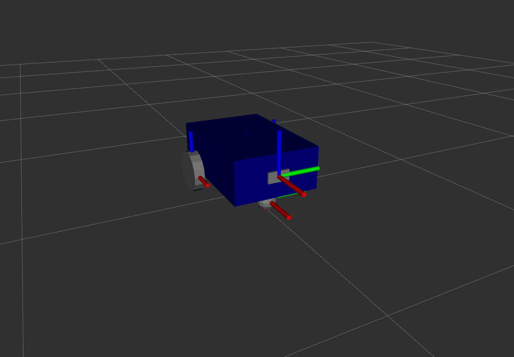
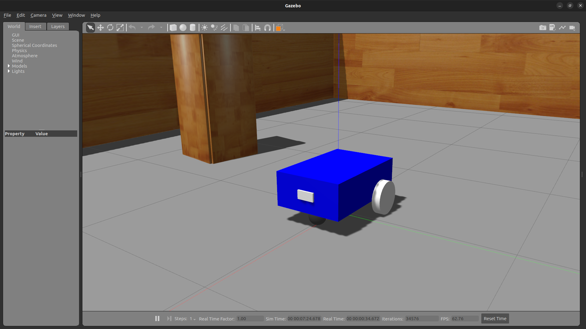
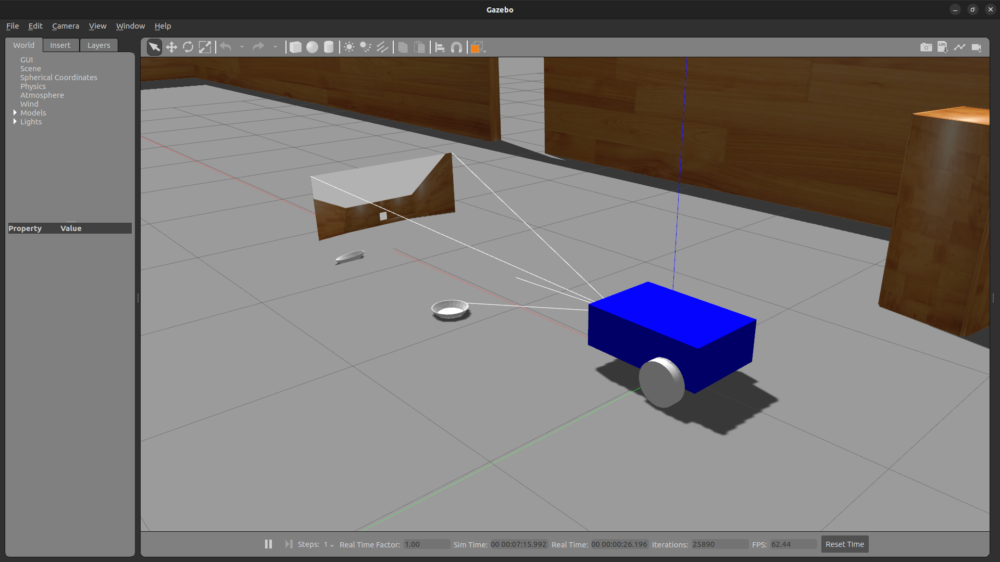
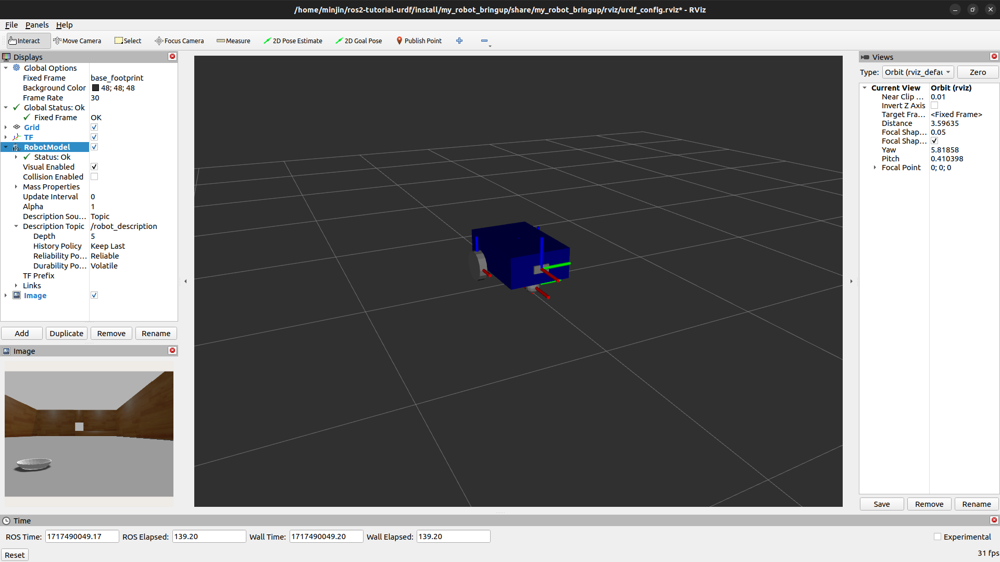

## Section 7. Add a Sensor in Gazebo

In this section, you will learn to add a sensor on the robot in Gazebo.

### Add a Camera to the URDF

Create a separate URDF file for a camera. First, create an empty file and name it `camera.xacro`.

```
cd ~/ros2_ws/src/my_robot_description/urdf
touch camera.xacro
```

Edit `camera.xacro` and write `camera_link` link tag and `base_camera_joint` joint tag as shown below.

```
<?xml version="1.0"?>
<robot xmlns:xacro="http://www.ros.org/wiki/xacro">

    <xacro:property name="camera_length" value="0.01" />
    <xacro:property name="camera_width" value="0.1" />
    <xacro:property name="camera_height" value="0.05" />

    <link name="camera_link">
        <visual>
            <geometry>
                <box size="${camera_length} ${camera_width} ${camera_height}" />
            </geometry>
            <origin xyz="0 0 0" rpy="0 0 0" />
            <material name="grey" />
        </visual>
        <collision>
            <geometry>
                <box size="${camera_length} ${camera_width} ${camera_height}" />
            </geometry>
            <origin xyz="0 0 0" rpy="0 0 0" />
        </collision>
        <xacro:box_inertia m="0.1" l="${camera_length}" w="${camera_width}" h="${camera_height}" xyz="0 0 0" rpy="0 0 0" />
    </link>

    <joint name="base_camera_joint" type="fixed">
        <parent link="base_link" />
        <child link="camera_link" />
        <origin xyz="${(base_length + camera_length) / 2.0} 0 ${base_height / 2.0}" rpy="0 0 0" />
    </joint>

</robot>
```

Edit `my_robot.urdf.xacro` to add `xacro:include` tag for the camera.

```
<?xml version="1.0"?>
<robot name="my_robot" xmlns:xacro="http://www.ros.org/wiki/xacro">

    <xacro:include filename="common_properties.xacro" />
    <xacro:include filename="mobile_base.xacro" />
    <xacro:include filename="mobile_base_gazebo.xacro" />
    <xacro:include filename="camera.xacro" />

</robot>
```

Build `my_robot_description` package and run a launch file with `display.launch.xml` to visualize the camera installation.

```
cd ~/ros2_ws/
colcon build --packages-select my_robot_description --symlink-install
source install/setup.bash
ros2 launch my_robot_description display.launch.xml
```



Also run a launch file with `my_robot_gazebo.launch.xml` and visualize the change made in Gazebo

```
ros2 launch my_robot_bringup my_robot_gazebo.launch.xml
```



### Add a Gazebo Plugin for the Camera

Previously a separate file named `mobile_base_gazebo.xacro` was created to include `gazebo` tags for the mobile base. You will do the same for the camera and create `camera_gazebo.xacro` file to place `gazebo` tags separately.

First, create an empty file named `camera_gazebo.xacro`.

```
cd ~/ros2_ws/src/my_robot_description/urdf
touch camera_gazebo.xacro
```

As described in the previous section, a list of plugins that you can use can be found from [Simulation Tools In ROS](https://github.com/ros-simulation) GitHub page. Go to [gazebo_ros_pkgs](https://github.com/ros-simulation/gazebo_ros_pkgs) repository and select the 'ros2' branch. Inside the `/gazebo_plugins/include/gazebo_plugins/` folder you can find various header files for different plugins, which can be directly accessed [here](https://github.com/ros-simulation/gazebo_ros_pkgs/tree/ros2/gazebo_plugins/include/gazebo_plugins).

Select `gazebo_ros_camera.hpp` and find "Example Usage". Copy the content of `plugin` tag and paste it into `sensor` tag in `camera_gazebo.xacro`. Change the sensor name to `camera_sensor` and the frame name to `camera_link`. Erase all the lines except `frame_name` tag for simplicity in this exercise. Also change the frame name to `camera_sensor`.

Edit `camera_gazebo.xacro` and include `gazebo` tag as shown below.

```
<?xml version="1.0"?>
<robot xmlns:xacro="http://www.ros.org/wiki/xacro">

    <gazebo reference="camera_link">
        <material>Gazebo/Red</material>
        <sensor name="camera_sensor" type="camera">
            <pose>0 0 0 0 0 0</pose>
            <visualize>true</visualize>
            <update_rate>30.0</update_rate>
            <plugin name="camera_controller" filename="libgazebo_ros_camera.so">
                <frame_name>camera_link</frame_name>
            </plugin>
        </sensor>
    </gazebo>

</robot>
```

Open `my_robot_urdf.xacro` and add the following line for camera installation.

```
<xacro:include filename="camera_gazebo.xacro" />
```

Build `my_robot_description` package and run a launch file with `my_robot_gazebo.launch.xml` to visualize the camera installation.

```
cd ~/ros2_ws/
colcon build --packages-select my_robot_description --symlink-install
source install/setup.bash
ros2 launch my_robot_bringup my_robot_gazebo.launch.xml
```



It is also possible now to create visualization for the image topic in RViz by adding `/camera_sensor/image_raw`.


