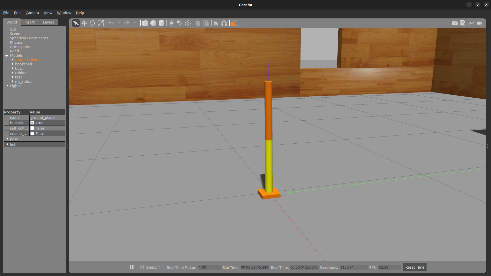
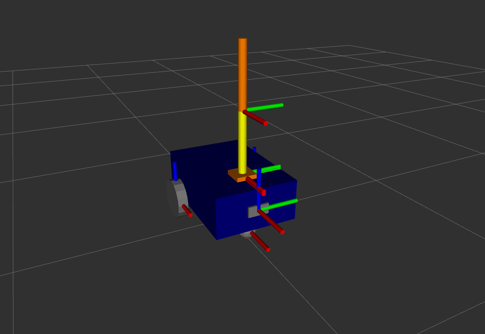
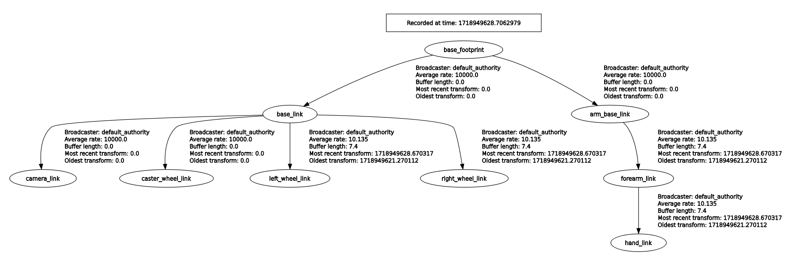
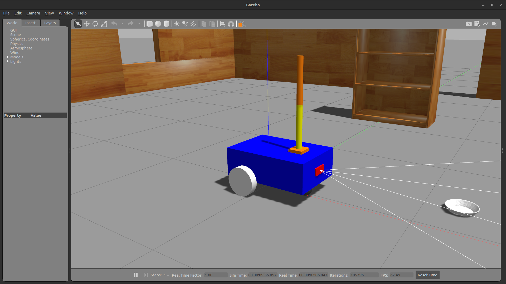
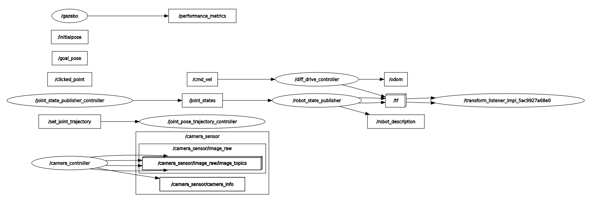

## Section 8. Final Project

For the final project of this course, you will add a small robotic arm on top of the mobile base that has been built previously.

The specifications for the robot arm are as follows:

URDF Links:
- arm_base_link:
  - Box: size 0.1 0.1 0.02
  - Color: orange
  - Mass: 0.5
- forearm_link:
  - Cylinder: radius 0.02 length 0.3
  - Color: yellow
  - Mass: 0.3
- hand_link:
  - Cylinder: radius 0.02, length 0.3
  - Color: orange
  - Mass: 0.3

URDF Joints:
- Between arm base and forearm:
  - Type: revolute
  - Limit: lower 0, upper pi/2, effort 100, velocity 100
  - Add some friction with `<dynamics friction="0.05" damping="0.1" />`
- Between forearm and hand:
  - Type: revolute
  - Limit: lower 0, upper pi/2, effort 100, velocity 100
  - Add some friction with `<dynamics friction="0.05" damping="0.1" />`

Gazebo plugins with required fields:
- joint_state_publisher:
  - update_rate: 10
  - joint_name: one for each joint in the arm
- joint_pose_trajectory:
  - update_rate: 2

### URDF for the Robotic Arm

Create a separate URDF file for the robotic arm. First, create an empty file and name it `arm.xacro`.

```
cd ~/ros2_ws/src/my_robot_description/urdf
touch arm.xacro
```

Edit `arm.xacro` file to include link and joint tags. For all three links (`arm_base_link`, `forearm_link`, and `hand_link`) the URDF file should include the visual tag containing geometry and material information as well as the collision and inertia tags for Gazebo simulation. Also write two joint tags (`arm_base_forearm_joint` and `forearm_hand_joint`) and for each joint include a dynamics tag, where appropriate values for friction and damping should be given.

```
<?xml version="1.0"?>
<robot xmlns:xacro="http://www.ros.org/wiki/xacro">

    <xacro:property name="arm_base_length" value="0.1" />
    <xacro:property name="arm_base_width" value="0.1" />
    <xacro:property name="arm_base_height" value="0.02" />
    <xacro:property name="forearm_radius" value="0.02" />
    <xacro:property name="forearm_length" value="0.3" />
    <xacro:property name="hand_radius" value="0.02" />
    <xacro:property name="hand_length" value="0.3" />

    <link name="arm_base_link">
        <visual>
            <geometry>
                <box size="${arm_base_length} ${arm_base_width} ${arm_base_height}" />
            </geometry>
            <origin xyz="0 0 ${arm_base_height / 2.0}" rpy="0 0 0" />
            <material name="orange" />
        </visual>
        <collision>
            <geometry>
                <box size="${arm_base_length} ${arm_base_width} ${arm_base_height}" />
            </geometry>
            <origin xyz="0 0 ${arm_base_height / 2.0}" rpy="0 0 0" />
        </collision>
        <xacro:box_inertia m="0.5" l="${2.0 * arm_base_length}" w="${2.0 * arm_base_width}" h="${2.0 * arm_base_height}" xyz="0 0 ${arm_base_height / 2.0}" rpy="0 0 0" />
    </link>

    <link name="forearm_link">
        <visual>
            <geometry>
                <cylinder radius="${forearm_radius}" length="${forearm_length}"/>
            </geometry>
            <origin xyz="0 0 ${forearm_length / 2.0}" rpy="0 0 0" />
            <material name="yellow" />
        </visual>
        <collision>
            <geometry>
                <cylinder radius="${forearm_radius}" length="${forearm_length}"/>
            </geometry>
            <origin xyz="0 0 ${forearm_length / 2.0}" rpy="0 0 0" />
        </collision>
        <xacro:cylinder_inertia m="0.3" r="${forearm_radius}" h="${forearm_length}" xyz="0 0 ${forearm_length / 2.0}" rpy="0 0 0" />
    </link>

    <link name="hand_link">
        <visual>
            <geometry>
                <cylinder radius="${hand_radius}" length="${hand_length}"/>
            </geometry>
            <origin xyz="0 0 ${hand_length / 2.0}" rpy="0 0 0" />
            <material name="orange" />
        </visual>
        <collision>
            <geometry>
                <cylinder radius="${hand_radius}" length="${hand_length}"/>
            </geometry>
            <origin xyz="0 0 ${hand_length / 2.0}" rpy="0 0 0" />
        </collision>
        <xacro:cylinder_inertia m="0.3" r="${hand_radius}" h="${hand_length}" xyz="0 0 ${hand_length / 2.0}" rpy="0 0 0" />
    </link>

    <joint name="arm_base_forearm_joint" type="revolute">
        <parent link="arm_base_link" />
        <child link="forearm_link" />
        <origin xyz="0 0 ${arm_base_height / 2.0}" rpy="0 0 0" />
        <axis xyz="0 1 0" />
        <limit lower="0" upper="${pi/2}" effort="100" velocity="100" />
        <dynamics friction="0.05" damping="0.1" />
    </joint>

    <joint name="forearm_hand_joint" type="revolute">
        <parent link="forearm_link" />
        <child link="hand_link" />
        <origin xyz="0 0 ${forearm_length}" rpy="0 0 0" />
        <axis xyz="0 1 0" />
        <limit lower="0" upper="${pi/2}" effort="100" velocity="100" />
        <dynamics friction="0.05" damping="0.1" />
    </joint>

</robot>
```

### Add Gazebo Plugins

Create a new file named `arm_gazebo.xacro` to add materials and Gazebo plugins.

```
cd ~/ros2_ws/src/my_robot_description/urdf
touch arm_gazebo.xacro
```

Edit `arm_gazebo.xacro` file to first include Gazebo reference tags to describe materials. Then add two Gazebo plugins: `joint_state_publisher_controller` and `joint_pose_trajectory_controller`. See the example usage part in `gazebo_ros_joint_state_publisher.hpp` and `gazebo_ros_joint_pose_trajectory.hpp` files that can be found in [gazebo_ros_pkgs](https://github.com/ros-simulation/gazebo_ros_pkgs/tree/ros2/gazebo_plugins/include/gazebo_plugins) GitHub repository.

```
<?xml version="1.0"?>
<robot xmlns:xacro="http://www.ros.org/wiki/xacro">

    <gazebo reference="arm_base_link">
        <material>Gazebo/Orange</material>
    </gazebo>

    <gazebo reference="forearm_link">
        <material>Gazebo/Yellow</material>
    </gazebo>

    <gazebo reference="hand_link">
        <material>Gazebo/Orange</material>
    </gazebo>

    <gazebo>
        <plugin name="joint_state_publisher_controller"
            filename="libgazebo_ros_joint_state_publisher.so">
            <!-- Update rate in Hertz -->
            <update_rate>10</update_rate>

            <!-- Name of joints in the model whose states will be published. -->
            <joint_name>arm_base_forearm_joint</joint_name>
            <joint_name>forearm_hand_joint</joint_name>
        </plugin>
    </gazebo>

    <gazebo>
        <plugin name="joint_pose_trajectory_controller"
            filename="libgazebo_ros_joint_pose_trajectory.so">
            <!-- Update rate in Hz -->
            <update_rate>2</update_rate>
        </plugin>
    </gazebo>

</robot>
```

Create a new file named `standalone_arm.urdf.xacro` in the URDF folder to include all the URDF files related to the robotic arm.

```
cd ~/ros2_ws/src/my_robot_description/urdf
touch standalone_arm.urdf.xacro
```

Edit `standalone_arm.urdf.xacro` as shown below.

```
<?xml version="1.0"?>
<robot name="my_robot" xmlns:xacro="http://www.ros.org/wiki/xacro">

    <xacro:include filename="common_properties.xacro" />
    <xacro:include filename="arm.xacro" />
    <xacro:include filename="arm_gazebo.xacro" />

</robot>
```

Now edit the URDF path in `my_robot_gazebo.launch.xml` (located in the launch folder for `my_robot_bringup` package) to load `standalone_arm.urdf.xacro` file instead of `my_robot.urdf.xacro`.

```
<let name="urdf_path" value="$(find-pkg-share my_robot_description)/urdf/standalone_arm.urdf.xacro" />
```

Build ROS packages and run a launch file with `my_robot_gazebo.launch.xml` to visualize the robotic arm in Gazebo.

```
cd ~/ros2_ws/
colcon build --symlink-install
source install/setup.bash
ros2 launch my_robot_bringup my_robot_gazebo.launch.xml
```



Test the joint_pose_trajectory plugin by running the following command in the terminal. Change the position values and observe the changes.

```
ros2 topic pub -1 /set_joint_trajectory trajectory_msgs/msg/JointTrajectory '{header: {frame_id: arm_base_link}, joint_names: [arm_base_forearm_joint, forearm_hand_joint], points: [{positions: {0.0, 0.5}}]}'
```

### Combine the Robotic Arm with the Mobile Base

Edit `my_robot.urdf.xacro` in the URDF folder for `my_robot_description` package to include the URDF files for the robotic arm. Add a joint tag to connect the mobile base with the robotic arm.

```
<?xml version="1.0"?>
<robot name="my_robot" xmlns:xacro="http://www.ros.org/wiki/xacro">

    <xacro:include filename="common_properties.xacro" />
    <xacro:include filename="mobile_base.xacro" />
    <xacro:include filename="mobile_base_gazebo.xacro" />
    <xacro:include filename="camera.xacro" />
    <xacro:include filename="camera_gazebo.xacro" />
    <xacro:include filename="arm.xacro" />
    <xacro:include filename="arm_gazebo.xacro" />

    <joint name="mobile_base_arm_joint" type="fixed">
        <parent link="base_footprint" />
        <child link="arm_base_link" />
        <origin xyz="${base_length / 4.0} 0 ${base_height + wheel_radius}" rpy="0 0 0" />
    </joint>

</robot>
```

Run a launch file with `display.launch.xml` to visualize the combined robot.

```
ros2 launch my_robot_description display.launch.xml
```



You can also visualize the TF tree to check the TF relationship for the combined robot.



Now edit the URDF path in `my_robot_gazebo.launch.xml` (located in the launch folder for `my_robot_bringup` package) to load `my_robot.urdf.xacro`.

```
<let name="urdf_path" value="$(find-pkg-share my_robot_description)/urdf/my_robot.urdf.xacro" />
```

Run a launch file with `my_robot_gazebo.launch.xml` to visualize the combined robot in Gazebo.

```
ros2 launch my_robot_bringup my_robot_gazebo.launch.xml
```



Open the node graph to see the current nodes and topics.

```
rqt_graph
```



Try controlling the robotic arm by running the following command in a separate terminal. Note that `frame_id` in the header should be `base_footprint` now.

```
ros2 topic pub -1 /set_joint_trajectory trajectory_msgs/msg/JointTrajectory '{header: {frame_id: base_footprint}, joint_names: [arm_base_forearm_joint, forearm_hand_joint], points: [{positions: {0.0, 0.0}}]}'
```

Also try moving the robot by publishing `/cmd_vel` topic as shown below.

```
ros2 topic pub /cmd_vel geometry_msgs/msg/Twist "{linear: {x: 0.2}, angular: {z: 0}}"
```
